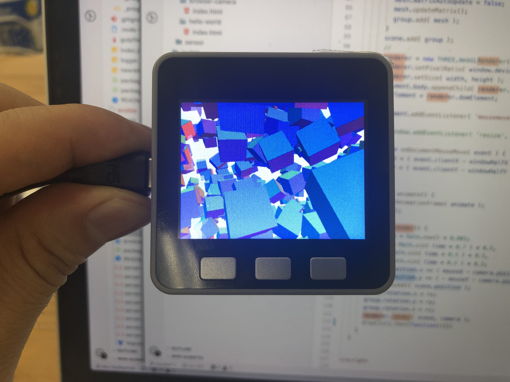

# M5Stack.js




SDK for controlling [M5Stack](https://m5stack.com/) with [obnizOS](https://obniz.io).
It works on both browser and nodejs.


# Usage

### HTML

```html
<!DOCTYPE html>
<html>
<head>
  <meta charset="UTF-8">
  <title>obnizOS on M5Stack</title>
  <script src="https://obniz.io/js/jquery-3.2.1.min.js"></script>
  <script src="https://unpkg.com/obniz@2.2.0/obniz.js"></script>
  <script src="https://unpkg.com/m5stackjs/m5stack.js"></script>
</head>
<body>

<div id="obniz-debug"></div>
buttonA:<span id="buttonA"></span><br/>


<script>
  let m5 = new M5Stack('OBNIZ_ID_HERE');

  m5.onconnect = async function () {

    m5.buttonA.onchange = (state)=>{
      $("#buttonA").text(state ? "pushed" : "released");
    }

    await m5.m5display.onWait();
    m5.m5display.print("Hello,world.");
    m5.m5display.print("This text show from browser.","yellow");
    m5.m5display.print("こんにちは");
    m5.m5display.print("안녕하세요");

    m5.m5display.font('Noteworthy',40);
    m5.m5display.print("Noteworthy","#FF0000")

	const servo = m5.wired("ServoMotor", {signal:2});
	servo.angle(90);
  };
</script>
</body>
</html>
```


### nodejs

```javascript
const M5Stack = require("m5stackjs");

let m5 = new M5Stack('OBNIZ_ID_HERE');

m5.onconnect = async function () {
  m5.buttonA.onchange = (state) => {
      console.log(state);
  }
  
  const servo = m5.wired("ServoMotor", {signal:2});
  servo.angle(90);

};

```

# Installation

### Browser
Add the following script tag to your html

```html
  <script src="https://unpkg.com/obniz/obniz.js"></script> <!-- m5stack.js use obniz.js.  load obniz.js before m5stack.js -->
  <script src="https://unpkg.com/m5stackjs/m5stack.js"></script>
```

### Nodejs
Install via npm

```
  npm install m5stackjs
```

and import it to js file.

```nodejs
  const M5Stack = require('m5stackjs');
```


# Examples

Examples is [here](/examples).

# Document
More details, see [M5Stackjs document](https://obniz.github.io/m5stackjs/classes/_src_m5stack_.m5stack.html) or [obniz document](https://obniz.io/doc/root)